# Dynamic Routing (eBGP)

## 前提条件

- VyOS (v1.4.0) を利用

## Dummy

Cisco のループバックインタフェースは VyOS ではダミーインタフェースになるらしい

- Loopback インタフェースの[設定](./loopback.txt)（これは使いにくいかも）
- Dummy インタフェースの[設定](./dummy.txt)

## 参考

### VyOS 関連

- [Loopback](https://docs.vyos.io/en/latest/configuration/interfaces/loopback.html)
- [Dummy](https://docs.vyos.io/en/latest/configuration/interfaces/dummy.html)
- [BGP](https://docs.vyos.io/en/latest/configuration/protocols/bgp.html)
- [ISO イメージ作成手順](https://server-network-note.net/2021/12/vyos-1-3-lts-iso-make/)

### BGP 関連

- [インターネット 10 分講座：BGP](https://www.nic.ad.jp/ja/newsletter/No35/0800.html)
- [BGP の技術](https://www.infraexpert.com/study/study60.html)
- [BFD ( Bidirectional Forwarding Detection )](https://www.infraexpert.com/study/routing11.html)
- [BGP - timers bgp](https://www.infraexpert.com/study/bgpz07.html)
- [EVE-NG とは](https://network-arekore.com/?p=1855)
