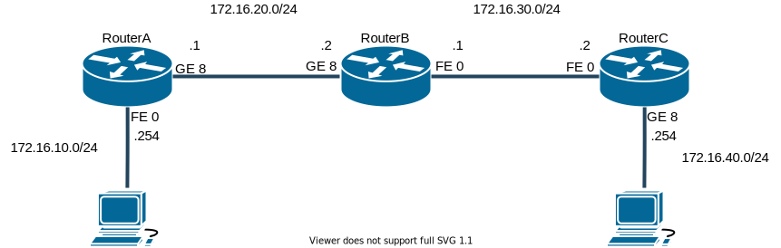

# Static Routing

## 参考

- [RIP をはじめから](https://www.infraexpert.com/study/study21.html)
- [Dynamic Routing](https://www.infraexpert.com/study/routing5.html)
- [show ip protocols, show ip route, debug ip rip](https://www.infraexpert.com/study/distancevector8.html)
