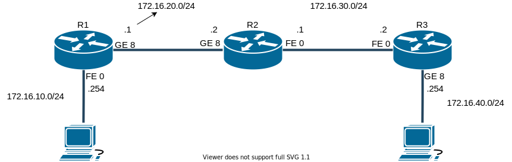

# Static Routing



## 結果

```powershell
PS C:\Users\LAPTOP-A> tracert 172.16.40.1

172.16.40.1 へのルートをトレースしています。経由するホップ数は最大 30 です

  1    <1 ms    <1 ms    <1 ms  172.16.10.254
  2     1 ms    <1 ms     1 ms  172.16.20.2
  3     1 ms     1 ms     1 ms  172.16.30.2
  4     2 ms     4 ms     6 ms  LAPTOP-B [172.16.40.1]

トレースを完了しました。
```

```powershell
PS C:\Users\LAPTOP-B> tracert 172.16.10.1

172.16.10.1 へのルートをトレースしています。経由するホップ数は最大 30 です

  1    <1 ms    <1 ms    <1 ms  172.16.40.254
  2     1 ms    <1 ms     1 ms  172.16.30.1
  3     1 ms     1 ms     1 ms  172.16.20.1
  4     2 ms     4 ms     4 ms  LAPTOP-A [172.16.10.1]

トレースを完了しました。
```

## 参考

- [Static Routing](https://www.infraexpert.com/study/routing3.html)
